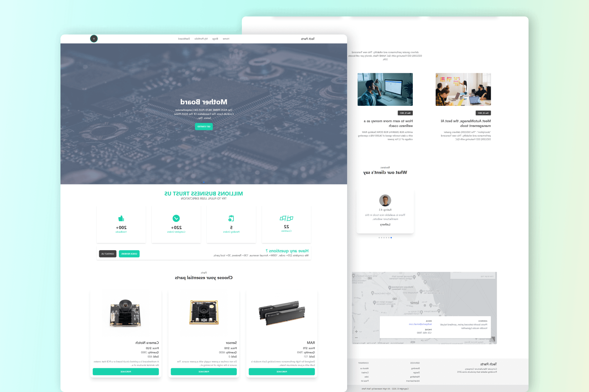

# Tech Parts (A computer manufacturer website)


## Tech-parts live website link
### https://tech-parts.web.app

## Tech-parts live server link
### https://techparts-server.onrender.com

## Admin Info

```
Email: user@tech.com
Password: Tech1234
```





## Website Features
- Dynamic website
- Single page Application (Using React)
- Can login using Google or gmail 
- User can buy products
- User can pay payment
- Admin role is added for Admin access
- Resposive for All devices


## Used Technologies (Fornt end)
- React JS 
- React Router
- Firebase for Authentication
- Most popular css utility based framwork Tailwindcss
- Tailwindcss component libraray daisyi 
- Axios for api call
- React query for caching data
- Aos for scrollin animation
- React Toastify for toast message
- Stripe for payment 


## Used Technologies (Backend)
- Express
- Cors
- Mongodb
- JWT
- Stripe
- Dotenv


## Connect with me  
<div align="center">
<a href="https://twitter.com/codernoyon" target="_blank">

</a>
<a href="https://dev.to/codernoyon" target="_blank">

</a>
<a href="https://linkedin.com/in/codernoyon" target="_blank">

</a>
<a href="https://www.facebook.com/codernoyon" target="_blank">

</a>
<a href="https://instagram.com/codernoyon" target="_blank">

</a>
<a href="https://github.com/codernoyon" target="_blank">

</a>
<a href="https://codepen.com/codernoyon" target="_blank">

</a>
<a href="https://stackoverflow.com/users/17615131/codernoyon" target="_blank">

</a>
<a href="https://dribbble.com/codernoyon" target="_blank">

</a>
<a href="https://www.behance.net/codernoyon" target="_blank">

</a>
<a href="https://www.youtube.com/c/codernoyon" target="_blank">

</a>  
</div>  
  

<br/> 

## Support Me 

 

<div align="center">
            <a href="https://www.buymeacoffee.com/codernoyon" target="_blank" style="display: inline-block;">
                
            </a>
            <a href="https://ko-fi.com/codernoyon" target="_blank" style="display: inline-block;">
                
            </a>
</div>  
